# Safed Sagar

**A browser-based MiG-21 reconnaissance flight experience over procedurally generated Himalayan terrain.**

Fly a recon sortie through the high Himalayas at 250 m/s. Find five fictional
observation posts hidden on ridgelines and passes, frame each one through a
nose-mounted optic, bring back usable photographs, and come home.

No weapons. No dogfights. Terrain is the only thing out here that can end the sortie.

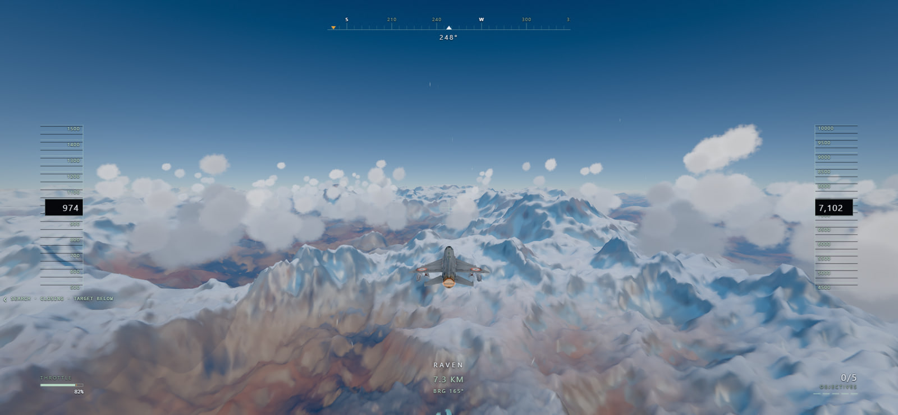

Runs entirely in the browser on WebGL2. Two runtime dependencies —
[three.js](https://threejs.org) and
[pmndrs/postprocessing](https://github.com/pmndrs/postprocessing). Everything
else — terrain, atmosphere, clouds, water, audio, the aircraft's exhaust, the
observation posts — is generated at runtime or at build time from code in this
repository.

---

## Table of contents

- [Quick start](#quick-start)
- [Controls](#controls)
- [What is in here](#what-is-in-here)
  - [Flight model and camera](#flight-model-and-camera)
  - [Terrain](#terrain)
  - [Sky, clouds and atmosphere](#sky-clouds-and-atmosphere)
  - [Reconnaissance](#reconnaissance)
  - [Presentation](#presentation)
  - [Audio](#audio)
  - [Performance and quality tiers](#performance-and-quality-tiers)
  - [Accessibility](#accessibility)
- [Project layout](#project-layout)
- [Development](#development)
- [Credits and licences](#credits-and-licences)
- [A note on the subject](#a-note-on-the-subject)

---

## Quick start

Requires **Node 20.19+ or 22.12+** (Vite 8) and a browser with **WebGL2**.

```bash
git clone <this-repo>
cd oss-web-3d
npm install
npm run dev
```

Then open the URL Vite prints. To build and preview a production bundle:

```bash
npm run build      # runs the GLSL check, then bundles to dist/
npm run preview
```

The whole experience is static once built — `dist/` can be served from any file
host with no server-side component.

---

## Controls

Keyboard, gamepad and touch are all first-class; the briefing shows whichever
one you last used.

| Key | Action |
| --- | --- |
| `W` / `S` or `↑` / `↓` | Climb / descend |
| `A` / `D` or `←` / `→` | Turn left / right |
| `Shift` | Boost (hold) |
| `Ctrl` | Slow down (hold) |
| `Z` | Airbrake |
| `Space` | Recon camera — toggle in Assisted, hold in Direct |
| `F` / `V` | Zoom the optic in / out |
| `Enter` | Manual shutter |
| `Tab` | Cycle objective |
| `Esc` | Pause |
| `` ` `` | Diagnostics panel (frame rate, render scale, detected tier) |

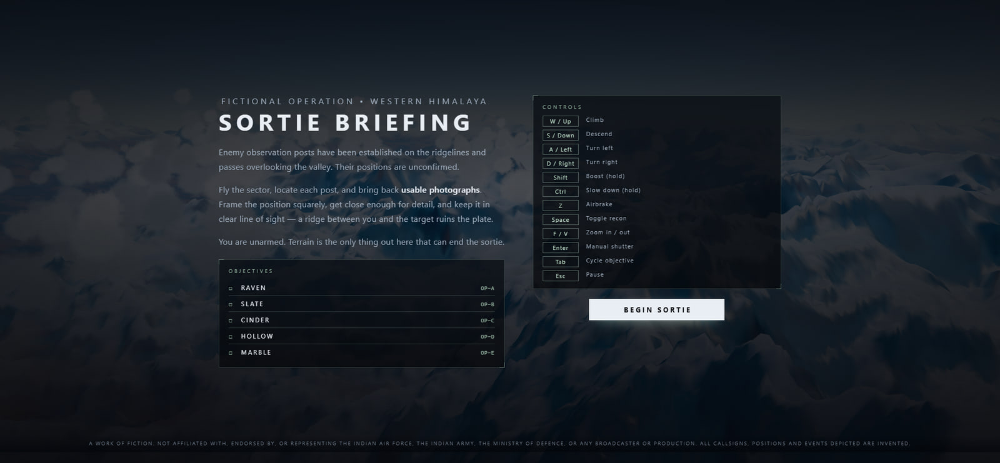

---

## What is in here

### Flight model and camera

An arcade flight model with real energy: inertia, banking, drag, gravity,
lift-induced drag, speed-dependent handling and light stall behaviour. Speed
bleeds in a hard turn and has to be flown back.

Assisted mode does not command a bank angle — it commands a **turn rate**, and
derives load factor and bank from it (`n = hypot(1, ωV/g)`, `bank = acos(1/n)`).
That is what makes the jet feel like it will actually go where you point it: at
250 m/s the normal profile sustains **24.5°/s** at up to **82° of bank and 8 G**,
and a measured 180° reversal completes in **9 seconds**. Direct mode gives you
the airframe with no envelope protection at all.

The chase camera is a spring rig with look-ahead, damping, speed-dependent FOV
and distance, and restrained vibration that rises with airspeed and G.

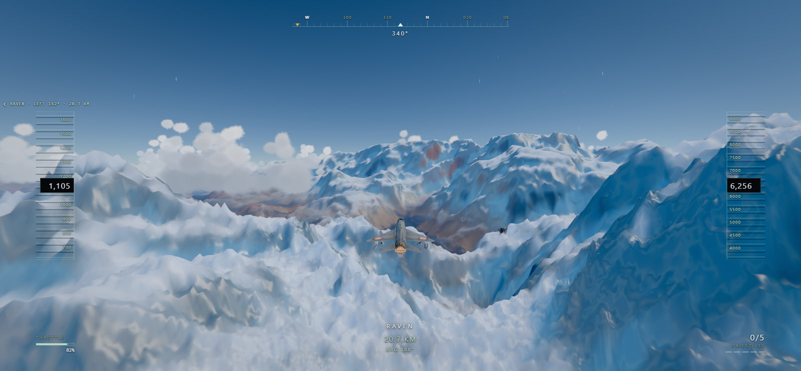

### Terrain

Deterministic and effectively infinite, generated from world coordinates with no
seed and no streaming server: ridged multifractal noise, FBM, domain warping and
erosion shaping, drawn through a GPU geometric clipmap with morphing LOD.
Material — snow, ice, scree, exposed rock, lee-slope drift — is classified in the
shader from slope, curvature, aspect and altitude.

The classification is a **pure function of world position**. Sample radii are
fixed in metres on a fixed clipmap level, so a patch of ground looks like the
same ground at 5 km and at 200 m — only filtered. Measured drift across a
250 m → 3.5 km approach: identical to three decimal places on every channel.

Gameplay queries run against a JS mirror of the same height field, so line of
sight, ground clearance and the terrain-proximity warning need no GPU readback.
GPU and CPU agree to **0.92 m maximum, 0.044 m mean** over 7,396 samples.

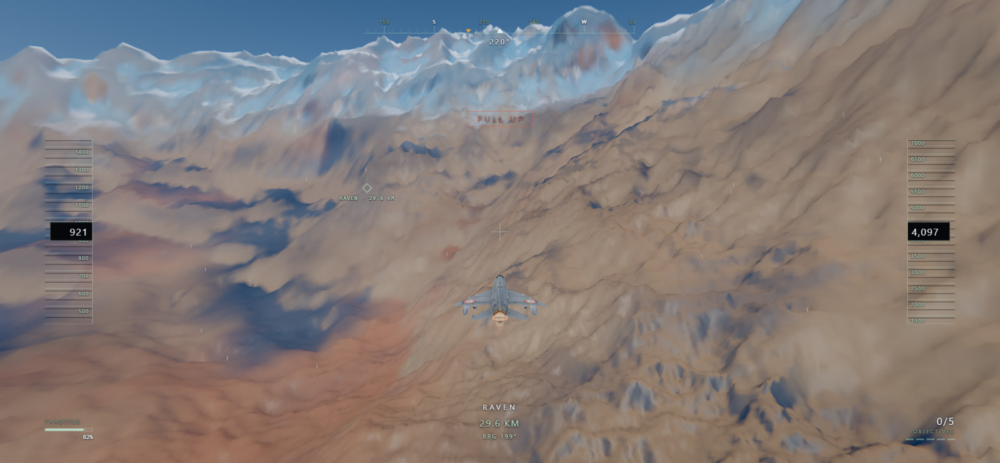

### Sky, clouds and atmosphere

The sky and aerial perspective are a physical Hillaire-style atmosphere with
precomputed transmittance and multiple-scattering LUTs, driving both the sky dome
and the haze that gives the range its scale.

Clouds are lit billboard clusters. A sprite atlas is baked once on the GPU —
spherical normal in RG, thickness in B, noise-eroded coverage in A — so each puff
is lit per pixel and has a curved terminator rather than a flat cut. Puffs are
clustered onto squashed ellipsoids placed from a coverage model, thinned so banks
have gaps, with bases spread over ~600 m so the deck is not one ruler-straight
line.

A separate density march still runs at low cost to drive the cloud shadow map, so
the shadow crossing the snow below belongs to a cloud that is really overhead.

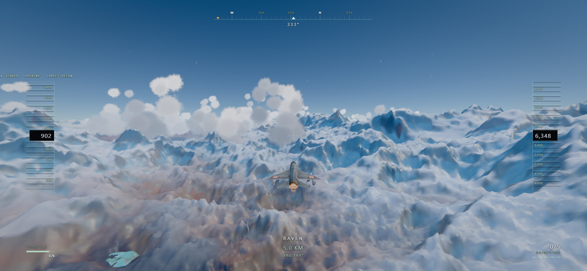

### Reconnaissance

Five fictional observation posts are placed on ridgelines, passes and mountain
shoulders. Each is built from features chosen for what they do at a particular
distance: pitched-roof shelters carry the silhouette at range because no mountain
makes a ridge line and two sloped planes; rows of fuel drums at even 2.15 m
centres read as *rhythm* even when they are a few pixels tall; rust and weathered
canvas are the only warm pixels within a kilometre of white. A 21 m guyed antenna
mast is the giveaway from the air.

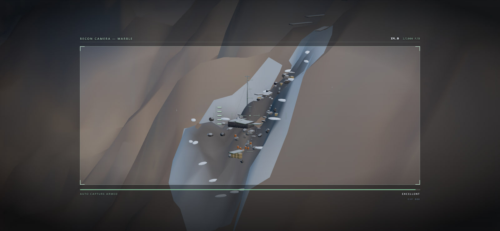

Photographs are scored on target visibility, framing, range, screen coverage and
viewing angle. Line of sight is checked against the height field, so a ridge
between you and the post ruins the plate.

Entering and leaving the optic is a bounded, eased transition in both directions —
both camera rigs run every frame and their poses are blended, with the field of
view interpolated geometrically. Scoring and the captured plate always see the
pure recon pose, never a frame mid-transition.

**Auto-capture** works the shutter for you. Flying the aircraft, holding a
telephoto on a ridge and finding `Enter` at the peak of the framing is three jobs
at once, and the third is the one that gets dropped — so the camera holds while
the score is still climbing and releases when it turns over. `Enter` still fires
manually whenever you want it.

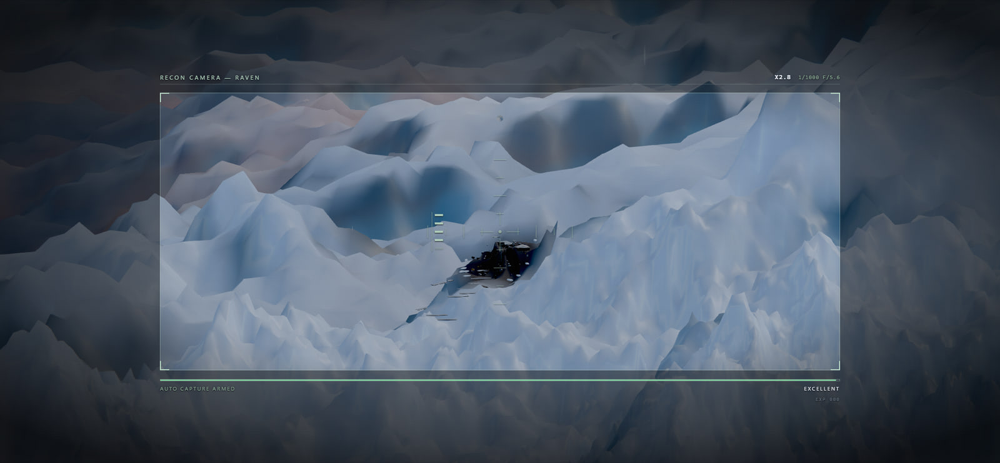

### Presentation

The title sequence, briefing, HUD, photography UI, pause menu and both debriefs
are art-directed as one piece rather than as separate developer panels.

<table>
  <tr>
    <td width="50%">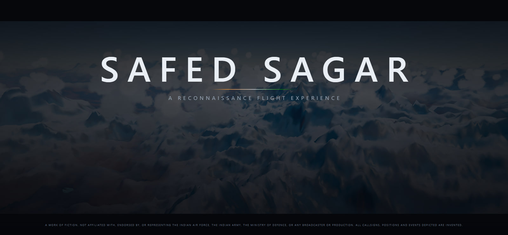</td>
    <td width="50%">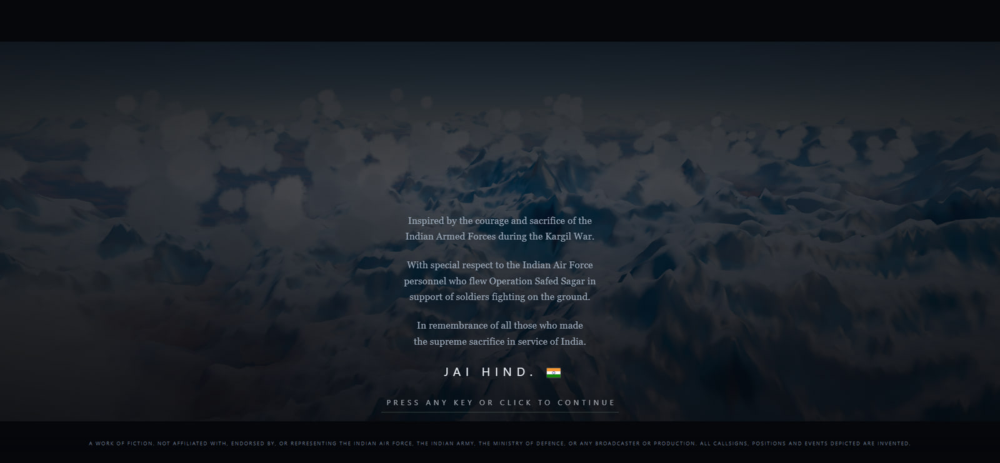</td>
  </tr>
</table>

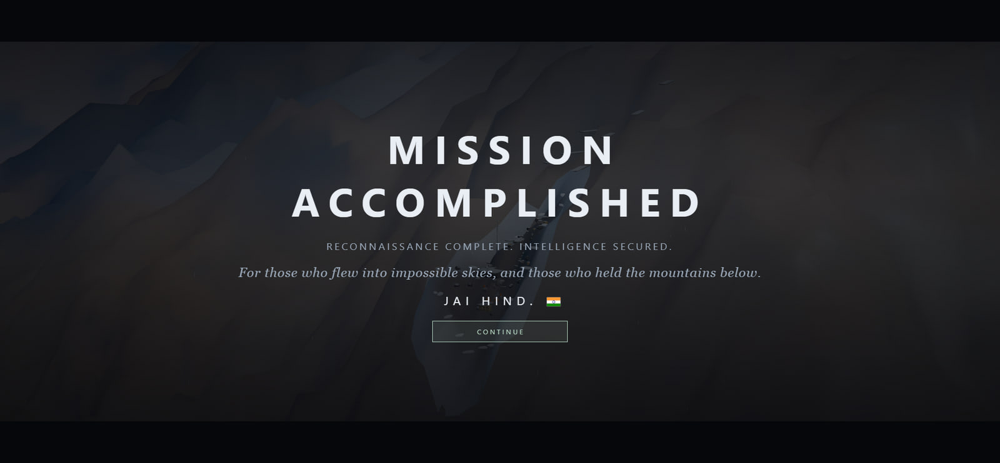

The sortie ends on a record card: every plate you brought back, its grade and
capture metadata, sortie statistics, and a local leaderboard of the fastest
complete sorties. A sortie only ranks if **every** objective was secured, and one
callsign holds one row — its best.

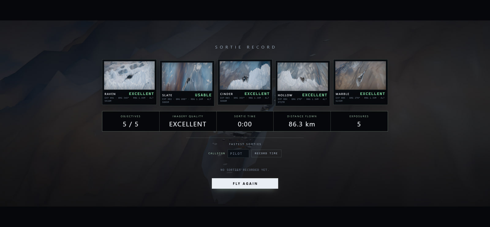

### Audio

Fully synthesised — no audio files ship with this project.

- **Engine** responds continuously to throttle, airspeed and altitude, with a
  two-channel noise bed so efflux, reheat and airflow decorrelate into a stereo
  image (measured correlation 0.32 above 500 Hz, while the low end stays centred).
- **Space** comes from a procedural stereo impulse response through a convolver,
  fed by per-source sends. Low and phone tiers run dry; medium gets a shorter IR.
- **G-loading** drives a cabin lowpass across every source including the score, so
  a hard turn reads as *you* greying out rather than as an effect on the world.
- **A transonic one-shot** fires at 295 m/s with a rearm band beneath it.
- **The score reacts** to target range, adding a fifth, doubling the pluck cadence
  and dropping a komal re underneath as tension rises — all booked at bar
  boundaries so layers arrive musically. The sortie melody spends the whole flight
  avoiding the tonic the drone holds; securing a post is the only place it lands
  there.

### Performance and quality tiers

Four tiers — **phone**, **low**, **medium**, **high** — differing in render scale,
bloom, SMAA, terrain resolution and budget, cloud march steps, cloud draw distance
and particle counts. The starting tier is auto-detected from the GPU's model
number, and the pause menu overrides it at any time.

On top of the tiers, an adaptive resolution scaler tracks frame time and trades
render scale for smoothness down to a floor of 0.62 (which still retains 38% of
the pixels), recovering as soon as frames get cheap again.

The design target is **≥ 30 fps at 1080p on an RTX 2060 Mobile class GPU** at the
tier such a machine auto-selects. That target is held by a measured cost model
rather than a frame-rate reading on hardware that cannot be made slow enough: the
fragment slope is fitted at two resolutions per pose, evaluated at 1080p and
inverted for the megapixel ceiling at 33.3 ms.

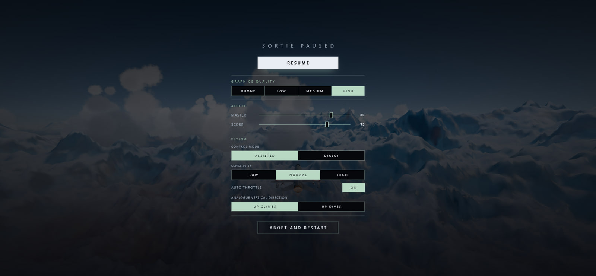

### Accessibility

- Assisted and Direct control modes
- Three sensitivity steps
- Invert pitch (`UP CLIMBS` / `UP DIVES`)
- Auto-throttle toggle
- Separate master and score volume
- Full keyboard, gamepad and touch parity, with on-screen touch controls on phones
- `prefers-reduced-motion` is honoured: staged entrances, the title sequence's
  timed beats and the UI's motion flourishes all collapse to static states
- Focus is trapped correctly inside modal screens, and the intro is gated on a
  press rather than autoplaying

---

## Project layout

```
src/
  core/      Engine, render pipeline, settings and tiers, input,
             touch controls, boot lifecycle, diagnostics panel
  flight/    Flight model, assist controller, aircraft, burner, chase camera
  fx/        Audio, adaptive music, flight effects,
             gpu/   GPU particle system and ribbons
             post/  Bloom, motion blur, sun shafts, lens artifacts,
                    auto exposure, cinematic grade
  game/      Game loop, mission, observation posts, recon camera,
             navigation hints, terrain visibility, leaderboard
  ui/        Title, briefing, HUD, recon overlay, pause, debriefs, styles
  world/     Terrain and clipmap, height field, atmosphere LUTs, sky,
             clouds, water, lakes
tools/       GLSL template check, model optimisation, terrain preview
public/      Optimised aircraft model, third-party notices
```

Shaders live in `*.glsl.js` modules as template literals and are shared between
the GPU material and its CPU mirror where gameplay needs the same answer.

## Development

```bash
npm run dev              # Vite dev server
npm run check            # GLSL template literal check
npm run build            # check + production bundle
npm run preview          # serve the production bundle
npm run optimize:model   # regenerate public/models/mig21.glb from assets/source/
```

Tests are plain `node:test` suites next to the code they cover:

```bash
node --test "src/**/*.test.mjs"
```

250 tests currently pass, alongside `npm run check` and `npm run build`.

A runtime harness is exposed on `window` in every build, which is how the
screenshots above were captured:

| Hook | Purpose |
| --- | --- |
| `__fly({x, z, agl, speed, heading})` | Jump straight into flight anywhere |
| `__toPost(index, range)` | Fly to an observation post on an approach with clear line of sight |
| `__recon(index, range, zoom)` | Do the above and enter the optic the way the pilot does |
| `__mission()` | Objective list with positions and capture state |
| `__gpuBench(frames)` / `__benchScaling()` | Frame cost, and the fragment-cost slope across resolutions |
| `__perf(ms)` / `__stats(stride)` | Frame-time distribution; image statistics |
| `__verifyTerrain(level)` | GPU-vs-CPU height field agreement |
| `__probeGLSL(expr, x, z)` | Evaluate a shader expression at a world position |
| `__audit()` | Buffered console entries, GL errors, draw call and program counts |

`?debug` in the URL forces the diagnostics panel on before the first frame.

---

## Credits and licences

This project's own code is MIT — see [LICENSE](LICENSE).

Third-party notices ship with the build in
[`public/THIRD_PARTY_NOTICES.txt`](public/THIRD_PARTY_NOTICES.txt):

- **Aircraft model** — ["MiG-21 Bison Indian (War Thunder)"](https://sketchfab.com/3d-models/mig-21-bison-indian-war-thunder-eaefc619a50047a0acf4af12cd269b92)
  by [KojfDiscord](https://sketchfab.com/KojfDiscord), used under
  [CC BY 4.0](http://creativecommons.org/licenses/by/4.0/). Optimised for the web
  by `tools/optimize-model.mjs`; the attribution travels inside the `.glb`.
- **GPU particle, ribbon, frame-uniform and impact-shell code** — adapted from
  [LinearAbiltyCastingThreeJS](https://github.com/achrefelouafi/LinearAbiltyCastingThreeJS)
  (MIT).
- **three.js** (MIT) and **postprocessing** (Zlib).

The atmosphere, cloud lighting and terrain classification are original
implementations written from published descriptions — Hillaire 2020,
Bruneton–Neyret, the Nubis and Frostbite cloud talks, geometric clipmaps and
CDLOD — with no code reused from those works. Further reading is collected in
[`docs/shared-visual-references.md`](docs/shared-visual-references.md).

## A note on the subject

Safed Sagar is inspired in tone and atmosphere by the 1999 Kargil conflict and by
Operation Safed Sagar, the Indian Air Force's part in it.

It is a **work of fiction**. It is not affiliated with, endorsed by, or
representing the Indian Air Force, the Indian Army, the Ministry of Defence, or
any broadcaster or production. No official insignia are used. All callsigns,
positions and events depicted are invented.

Remembrance is kept deliberately separate from score: the memorial card carries no
statistics, and the mission result carries no memorial. Failure ends the sortie
respectfully rather than using real sacrifice as a penalty.

> Inspired by the courage and sacrifice of the Indian Armed Forces during the
> Kargil War. With special respect to the Indian Air Force personnel who flew
> Operation Safed Sagar in support of soldiers fighting on the ground. In
> remembrance of all those who made the supreme sacrifice in service of India.
>
> **Jai Hind.** 🇮🇳
